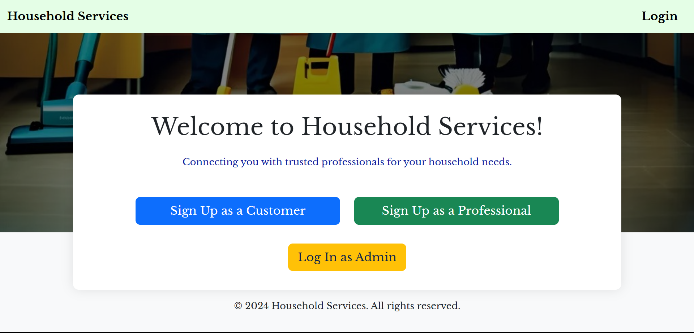
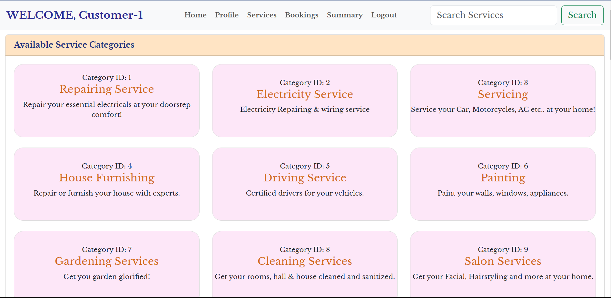
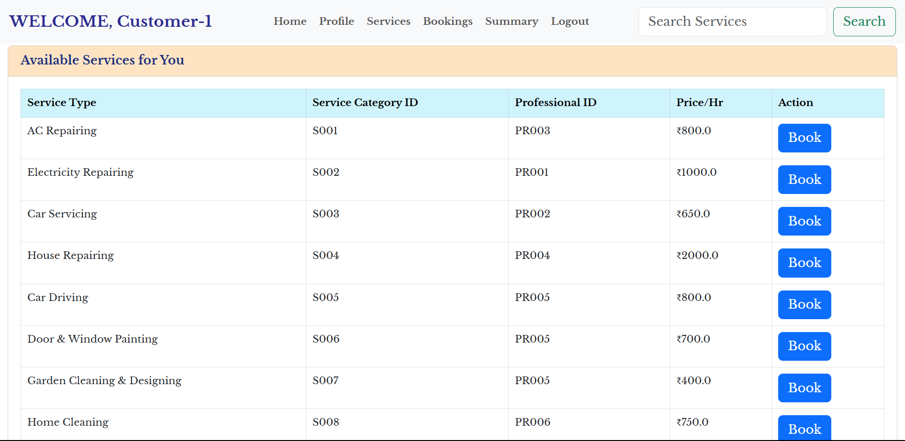
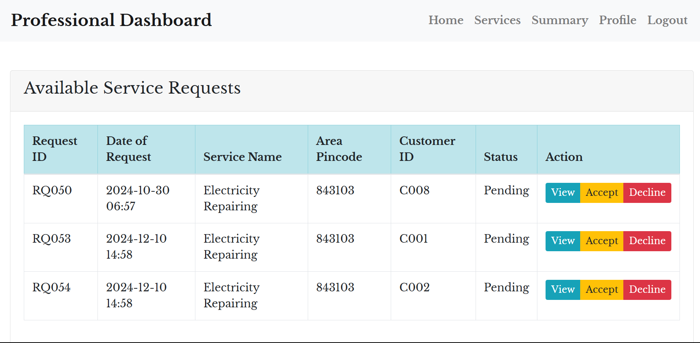
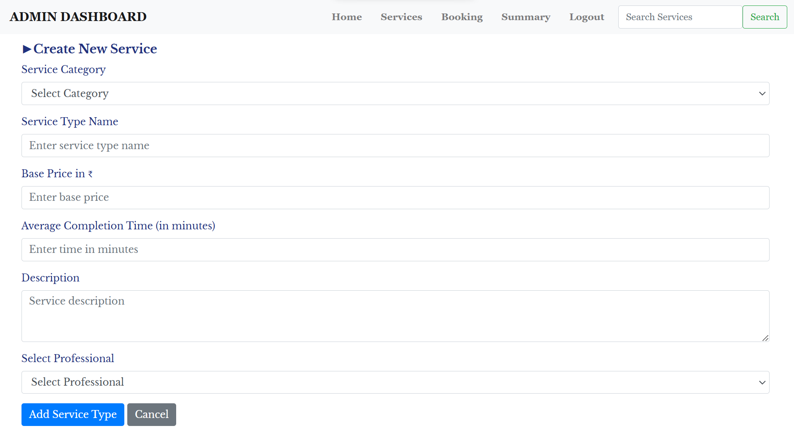
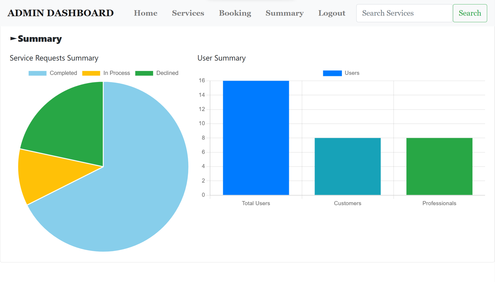
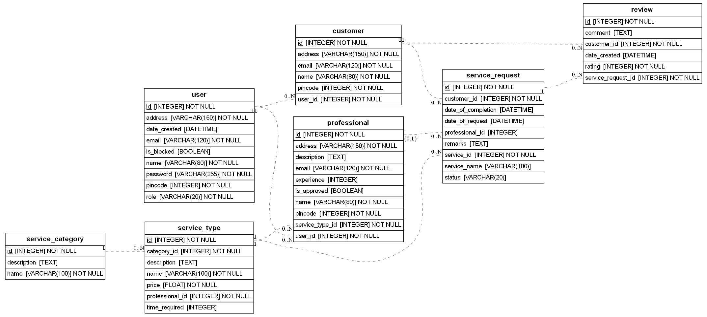

# Household Services Application



## Overview
The Household Services Application is a multi-user platform designed to streamline household service management. It allows users to connect with service professionals, manage service requests, and provide efficient solutions for household needs. The application is developed as part of the **Modern Application Development I** course project, showcasing a robust, user-friendly, and scalable solution.

## Features








### Core Functionalities
1. **User Roles**
   - **Admin**: Manages service categories, service types, professionals, and overall platform operations.
   - **Service Professional**: Manages service availability, responds to service requests, and maintains their profile.
   - **Customer**: Browses services, creates service requests, and tracks service history.

2. **Authentication and Authorization**
   - Secure login and role-based access.
   - User registration for Customers and Professionals.

3. **Service Management**
   - Admin can create and manage service categories and types.
   - Professionals can list their services with descriptions and availability.

4. **Service Requests**
   - Customers can create and track service requests.
   - Professionals can accept/reject and update the status of service requests.

5. **Search Functionality**
   - Dynamic search for Customers, Professionals, Services, and Service Requests.

### Additional Features
- **Dashboard Summaries**
  - Admin dashboard with statistical summaries (pie charts, bar graphs).
  - Professional and Customer dashboards for personalized information.
- **Validation**
  - Frontend and Backend validation to ensure data integrity.
- **Responsive Design**
  - A user-friendly interface with Bootstrap styling.
- **APIs**
  - Optional RESTful API resources for integration and scalability.

---

## Technology Stack
- **Frontend**: HTML, CSS, Bootstrap, Jinja2
- **Backend**: Flask (Python)
- **Database**: SQLite with SQLAlchemy ORM
- **Visualization**: Charts.js for graphical summaries
- **Tools**: ERAlchemy for ERD generation

---

## Setup and Installation
### Prerequisites
- Python 3.9 or higher
- pip (Python package manager)

### Installation Steps
1. **Clone the Repository**
   ```bash
   git clone https://github.com/yourusername/household-services-app.git
   cd household-services-app
   ```

2. **Create a Virtual Environment**
   ```bash
   python -m venv venv
   source venv/bin/activate  # On Windows: venv\Scripts\activate
   ```

3. **Install Dependencies**
   ```bash
   pip install -r requirements.txt
   ```

4. **Set Up the Database**
   ```bash
   flask db init
   flask db migrate -m "Initial migration."
   flask db upgrade
   ```

5. **Run the Application**
   ```bash
   flask run
   ```
   Access the application at `http://127.0.0.1:5000`

---

## Directory Structure
```
Household-Services-App/
├── code/
│   ├── app.py               # Main application
│   ├── models.py            # Database models
│   ├── routes/
│   │   ├── admin.py         # Admin-specific routes
│   │   ├── professional.py  # Professional-specific routes
│   │   └── customer.py      # Customer-specific routes
│   ├── templates/           # HTML templates
│   ├── static/
│       ├── css/             # Custom stylesheets
│       ├── js/              # JavaScript files
│       └── images/          # Application images
├── migrations/              # Database migrations
├── requirements.txt         # Required Python packages
└── README.md                # Project documentation
```

---

## ER Diagram
The application follows a well-defined database schema. Below is the Entity-Relationship Diagram (ERD) generated using ERAlchemy:

- **Entities**:
  - `User`
  - `Customer`
  - `Professional`
  - `ServiceCategory`
  - `ServiceType`
  - `ServiceRequest`


## Contact
For queries or support, feel free to reach out:
- **Email**: satyam2610saurabh@gmail.com

